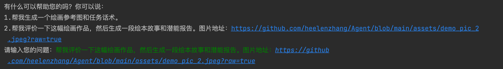

# 1. Project Introduction

This project is a demo of an early childhood education drawing AI Assistant Agent based on langchain + chatgpt.

# 2. Directory Structure

```
├── src: Functional code
├── assets: Related resources
├── configs: Configuration parameters
├── vector_store: Vector index file storage
├── run.py: Demonstration execution file
```


# 3. Usage Instructions
1. For the first experience, execute the file: `src/Vector_store.py` first to import the sample student data into the vector database. Afterwards, just execute `run.py`.
2. The versions of Langchain and OpenAI used in this project are `0.0.340` and `1.3.2`, respectively. If you encounter problems with other versions, consider installing these versions.
3. When importing the full amount of student data, first clear the corresponding directory under `vector_store`.


# 3. AI Assistant Demonstration Interface
1. Demonstration of the "Painting Evaluation, Picture Story, and Potential Report Design" task.
-----------------------------



2. Demonstration of the "Painting Reference Image and Task Script" task.
-----------------------------

-----------------------------


